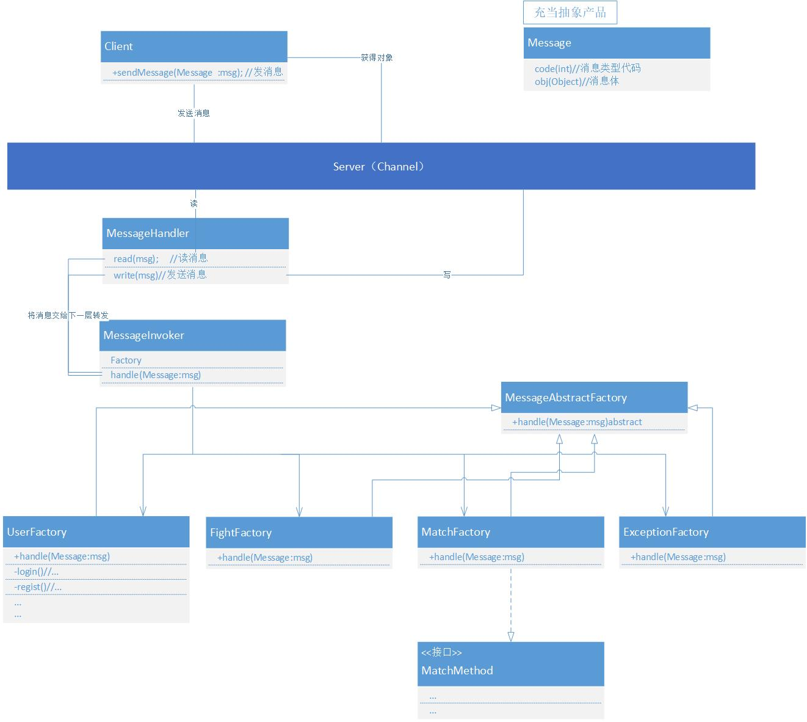

# 核心代码

## **无视掉第二列的注释，很多都是错的**

### com.easyArch.entity-----包含各种实体类
### com.easyArch.utils------包含各种工具类
### com.easyArch.service----业务逻辑
### com.easyArch.net--------网络相关

### com.easyArch.invoker----也不知道该咋起名，未来想用设计模式优化一下，减少重复代码，增加复用性

 
